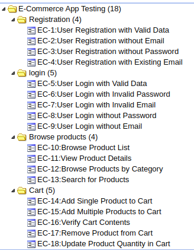
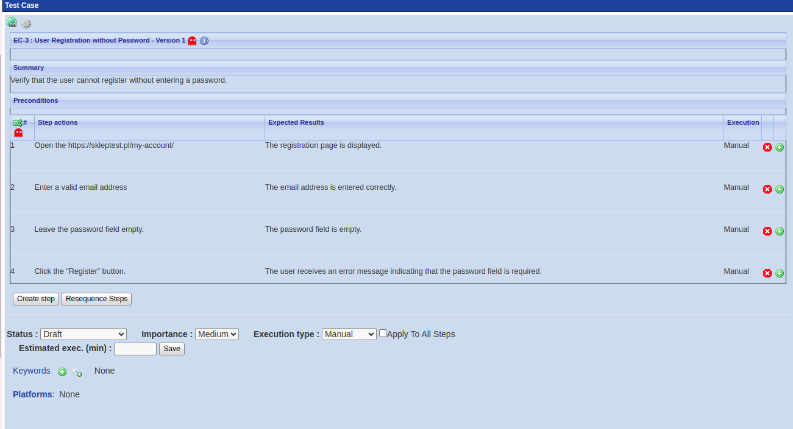

# Project 1: Manual Testing

## Description
This project involves manual testing of the e-commerce website [https://skleptest.pl/](https://skleptest.pl/). The tests focus on critical user functionalities such as registration, login, product browsing, and shopping cart functionalities.

## Test Plan
The objective of this test plan is to verify the functionality of the e-commerce website.

### Scope of Testing
1. Registration
2. Login
3. Product Browsing
4. Shopping Cart

### Testing Environment
- Operating System: Ubuntu
- Browser: Google Chrome

### Types of Tests
1. Functional Tests
2. Usability Tests
3. Regression Tests

### Entry Criteria
- Test environment is set up and ready.
- Test cases are reviewed and approved.
- Access to the website [https://skleptest.pl/](https://skleptest.pl/) is available.

### Exit Criteria
- All test cases are executed.
- All critical and major defects are fixed and re-tested.
- Test summary report is prepared and reviewed.

### Test Cases
- [Registration Test Cases](TestCases_Registration.md)
- [Login Test Cases](TestCases_Login.md)
- [Product Browsing Test Cases](TestCases_ProductBrowsing.md)
- [Shopping Cart Test Cases](TestCases_Cart.md)

### [Test Plan](TestPlan.md)

### Screenshots

#### TestLink Test Cases List

#### TestLink Test Case Details

