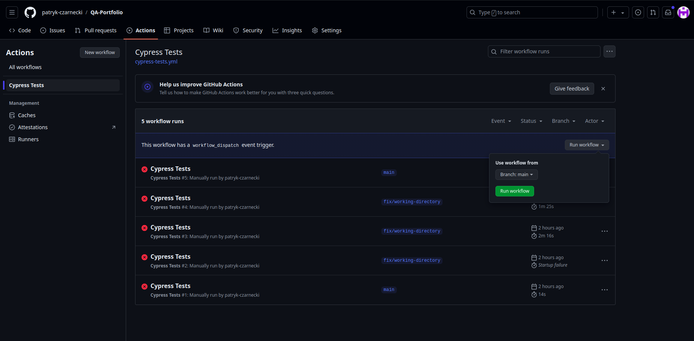
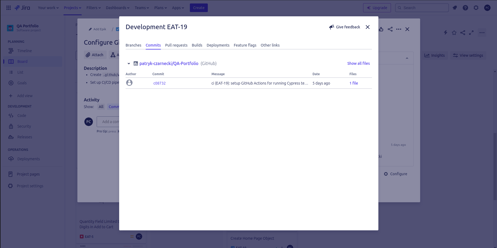

# Project 2: Automated Testing with Cypress

## Description
This project involves automated testing of the e-commerce website [https://skleptest.pl/](https://skleptest.pl/). The tests focus on critical user functionalities such as registration, login, and shopping cart functionalities.

## Test Plan

### Description
The objective of this project is to verify the functionality of the e-commerce website [https://skleptest.pl/](https://skleptest.pl/). The tests focus on critical user functionalities such as registration, login, and shopping cart functionalities. The testing environment includes Ubuntu operating system with Google Chrome as the browser. The types of tests to be conducted include functional tests. The criteria for test completion is 100% execution of all test cases.

### Scope of Testing

1. **Registration**: Ensuring that new users can register successfully with all required information.
2. **Login**: Verifying that registered users can log in and access their accounts.
3. **Shopping cart functionality**: Verify that users can add items, update quantities, view the cart from any page, and remove items.

### Testing Environment

- **Operating System**: Ubuntu
- **Browser**: Google Chrome

### Types of Tests

1. **Functional Tests**: To verify that each feature works according to the requirements.

## Test Cases

### Registration Test Cases
- **registration.cy.js**: Test cases for user registration.
  - Register a new user with valid data.
  - Show error for existing email.

### Login Test Cases
- **login.cy.js**: Test cases for user login.
  - Log in with valid credentials.
  - Show error for invalid password.
  - Show error for non-existent email.
  - Show error for empty email.
  - Show error for empty password.

### Shopping Cart Test Cases
- **cart.cy.js**: Test cases for shopping cart functionalities.
  - Add a product to the cart.
  - Remove a product from the cart.
  - Update the product quantity in the cart.

## Automated Tests

### Registration Tests (`registration.cy.js`)
```javascript
import RegistrationPage from '../pages/registrationPage';
import HomePage from '../pages/homePages';
import data from '../fixtures/example.json';

const registrationPage = new RegistrationPage();
const homePage = new HomePage();

describe('User Registration', () => {
  it('should register a new user with valid data', () => {
    cy.visit('/');
    homePage.goToRegistration();
    registrationPage.fillEmail(data.registration.valid.email);
    registrationPage.fillPassword(data.registration.valid.password);
    registrationPage.submit();
    cy.contains(data.registration.valid.successMessage).should('be.visible');
  });

  it('should show error for existing email', () => {
    cy.visit('/');
    homePage.goToRegistration();
    registrationPage.fillEmail(data.registration.existingEmail.email);
    registrationPage.fillPassword(data.registration.existingEmail.password);
    registrationPage.submit();
    cy.contains(data.registration.existingEmail.errorMessage).should('be.visible');
  });
});
```

### Login Tests (`login.cy.js`)
```javascript
import LoginPage from '../pages/loginPage';
import HomePage from '../pages/homePages';
import data from '../fixtures/example.json';

const loginPage = new LoginPage();
const homePage = new HomePage();

describe('User Login', () => {
  it('should log in with valid credentials', () => {
    cy.visit('/');
    homePage.goToLogin();
    loginPage.fillEmail(data.login.valid.email);
    loginPage.fillPassword(data.login.valid.password);
    loginPage.submit();
    cy.contains(data.login.valid.successMessage).should('be.visible');
  });

  it('should show error for invalid password', () => {
    cy.visit('/');
    homePage.goToLogin();
    loginPage.fillEmail(data.login.invalidPassword.email);
    loginPage.fillPassword(data.login.invalidPassword.password);
    loginPage.submit();
    cy.contains(data.login.invalidPassword.errorMessage).should('be.visible');
  });

  it('should show error for non-existent email', () => {
    cy.visit('/');
    homePage.goToLogin();
    loginPage.fillEmail(data.login.nonExistentEmail.email);
    loginPage.fillPassword(data.login.nonExistentEmail.password);
    loginPage.submit();
    cy.contains(data.login.nonExistentEmail.errorMessage).should('be.visible');
  });

  it('should show error for empty email', () => {
    cy.visit('/');
    homePage.goToLogin();
    loginPage.fillPassword(data.login.emptyEmail.password);
    loginPage.submit();
    cy.contains(data.login.emptyEmail.errorMessage).should('be.visible');
  });

  it('should show error for empty password', () => {
    cy.visit('/');
    homePage.goToLogin();
    loginPage.fillEmail(data.login.emptyPassword.email);
    loginPage.submit();
    cy.contains(data.login.emptyPassword.errorMessage).should('be.visible');
  });
});
```

### Shopping Cart Tests (`cart.cy.js`)
```javascript
import CartPage from '../pages/cartPage';
import HomePage from '../pages/homePages';
import data from '../fixtures/example.json';

const cartPage = new CartPage();
const homePage = new HomePage();

describe('Shopping Cart', () => {
  it('should add a product to the cart', () => {
    cy.visit('/');    
    cartPage.addFirstProductToCart();
    cy.contains('Product added to cart').should('be.visible');
  });
  
  it('should update the product quantity in the cart', () => {
    cy.visit('/');
    cartPage.addFirstProductToCart();
    homePage.goToCart();    
    cartPage.updateProductQuantity(2);
    cy.get('.quantity input').should('have.value', '2');
  });

  it('should remove a product from the cart', () => {
    cy.visit('/');
    cartPage.addFirstProductToCart();
    homePage.goToCart();
    cartPage.removeFirstProductFromCart();
    cy.contains('Product removed from cart').should('be.visible');
  });
});
```

## Page Object Model (POM)

To improve the maintainability and scalability of the tests, we use the Page Object Model (POM) design pattern. This pattern helps to keep the code organized by creating a separate class for each page of the application.

### Example of Page Object Model

#### `pages/loginPage.js`
```javascript
class LoginPage {
    
    fillEmail(value) {
      cy.get('[name="username"]').type(value);
    }
  
    fillPassword(value) {
      cy.get('#password').type(value);
    }
  
    submit() {
      cy.get('[name="login"]').click();
    }
  }
  
  export default LoginPage;
```

#### `pages/registrationPage.js`
```javascript
class RegistrationPage {
     
    fillEmail(value) {
      cy.get('#reg_email').type(value);
    }
  
    fillPassword(value) {
      cy.get('#reg_password').type(value);
    }
  
    submit() {
      cy.get('[value="Register"]').click();
    }  
  }
  
  export default RegistrationPage;
```

#### `pages/homePages.js`
```javascript
class HomePage {
      
    goToRegistration() {
      cy.get('a[href="https://skleptest.pl/my-account/"]').click();
    }
  
    goToLogin() {
      cy.get('a[href="https://skleptest.pl/my-account/"]').click();
    }
        
    goToCart() {
      cy.get('a[href="https://skleptest.pl/cart/"]').click();
    }
  }
  
  export default HomePage;
```

#### `pages/cartPage.js`
```javascript
class CartPage {
      
    addFirstProductToCart() {
      cy.get('.owl-item.active .add_to_cart_button').first().click();
    }
  
    removeFirstProductFromCart() {
      cy.get('.remove').first().click();
    }
  
    updateProductQuantity(quantity) {
      cy.get('.quantity input').clear().eq(1).type(quantity);
      cy.get('[name="update_cart"]').click();
    }
  }
  
  export default CartPage;
```
### Test Data

The test data used in the automated tests is stored in the example.json file. This file contains various sets of data required for different test cases.

#### `example.json`
```json
{
  "registration": {
    "valid": {
      "email": "testowyemail@gmail.com",
      "password": "Testowehaslo1@",
      "successMessage": "Hello testowyemail"
    },
    "existingEmail": {
      "email": "testowyemail@gmail.com",
      "password": "testowehaslo1@",
      "errorMessage": "An account is already registered with your email address."
    }
  },
  "login": {
    "valid": {
      "email": "testowyemail@gmail.com",
      "password": "testowehaslo1@",
      "successMessage": "Hello testowyemail"
    },
    "invalidPassword": {
      "email": "testowyemail@gmail.com",
      "password": "nieprawidlowehaslo",
      "errorMessage": "Error: The password you entered for the username testowyemail@gmail.com is incorrect."
    },
    "nonExistentEmail": {
      "email": "nieistniejacyemail@gmail.com",
      "password": "testowehaslo1@",
      "errorMessage": "Error: A user could not be found with this email address."
    },
    "emptyEmail": {
      "email": "",
      "password": "testowehaslo1@",
      "errorMessage": "Error: Username is required."
    },
    "emptyPassword": {
      "email": "testowyemail@gmail.com",
      "password": "",
      "errorMessage": "Error: The password field is empty."
    }
  }
}
```

## CI/CD Pipeline

This project uses GitHub Actions for Continuous Integration and Continuous Deployment. The workflow is defined in `.github/workflows/cypress-tests.yml` and runs the Cypress tests manually via the `workflow_dispatch` event.

### GitHub Actions Workflow Configuration
```yaml
name: Cypress Tests

on: workflow_dispatch
  
jobs:
  test:
    runs-on: ubuntu-latest
    defaults:  
      run:
        working-directory: ./Project2-Cypress

    steps:
      - name: Checkout code
        uses: actions/checkout@v6

      - name: Setup Node.js
        uses: actions/setup-node@v3
        with:
          node-version: '18'

      - name: Install dependencies
        run: npm install

      - name: Run Cypress tests
        run: npm run run
        env:
          CI: true
```

## How to Run Tests in GitHub Actions

1. Navigate to the **Actions** tab in GitHub repository.

2. In the left sidebar, you will see the **Cypress Tests** workflow. Click on it.

3. Click the **Run workflow** dropdown on the right side.

4. In the dropdown, select the branch on which you want to run the tests.

5. Click the **Run workflow** button.



## Prerequisites

### Install Node.js and npm

If you do not have Node.js and npm installed, download and install them from [here](https://nodejs.org/).

## How to Run Tests Locally

1. Clone the repository:

```bash
git clone git clone https://github.com/patryk-czarnecki/QA-Portfolio.git


## How to Run Tests Locally

1. Clone the repository:

```bash
git clone git clone https://github.com/patryk-czarnecki/QA-Portfolio.git
```
2. Install dependencies:

```bash
npm install
```
3. Run Cypress tests:
```bash
npm run test
```

## Integration with Jira

This project is integrated with Jira to enhance issue tracking and project management. The integration allows for automatic linking of GitHub commits and pull requests to Jira issues.

### Key Benefits

- Automatic linking of commits and pull requests to Jira issues.
- Enhanced visibility of development progress within Jira.
- Streamlined workflow between code changes and issue tracking.

### How to Set Up Integration

1. Install the **GitHub for Jira** app from the Atlassian Marketplace.
2. Connect your GitHub account to Jira.
3. Map your GitHub repositories to Jira projects.

### Example

- **Tracking commits**:


## Conclusion

This project demonstrates how to automate testing of an e-commerce website using Cypress, with CI/CD implemented via GitHub Actions and integration with Jira for enhanced project management and issue tracking.
